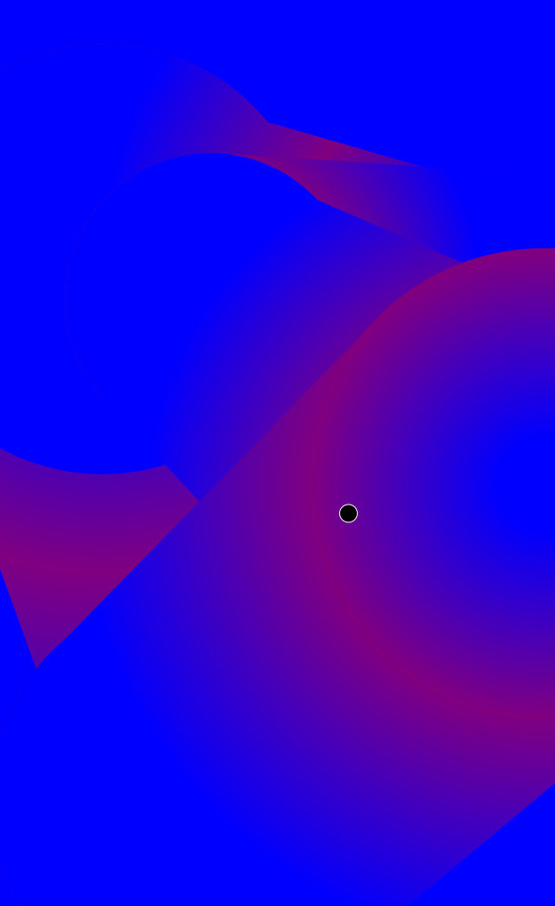

# Generative graphics and art
 

The latest generated image can be seen below:

### Status
-----
#### Current
- [ ] Represent graphics with low resolution dotting-system 
- [ ] Canvas metrics
#### Todo
- [ ] Evaluation agents
- [ ] Size normalization
- [ ] Curve fitting
- [ ] Weight system
- [ ] Polarity system
- [ ] Intersection trait
- [ ] Composition agent
- [ ] ... agents
#### On hold
- [ ] NURBS representation (Will use triangle mesh instead)
- [ ] Add light sources
- [ ] Determine values through path tracing
- [ ] Gradient mesh
#### Done
- [X] Expert system architecture
- [X] SVG templating
- [X] Serve the SVG over http
- [X] Generate content from a profile
- [X] Allow for perspective and add camera

## About 
This projects is a program for creating graphics by sending a HTTP request. The tool uses a visual identity as well as a smart expert-system do generate its designs. This way, images (such that follows some visual identities) can easily be created with a different look every time, while still following the visual guidelines.

The API enables:
* Creation of graphics that is difficult to design in e.g. Adobe Illustrator, such as fractals.
* Generate unique avatars (like those found on Github or Slack).
* Generate documents and graphics with a persistent look (such as banners, posters & invoices).
* ...
